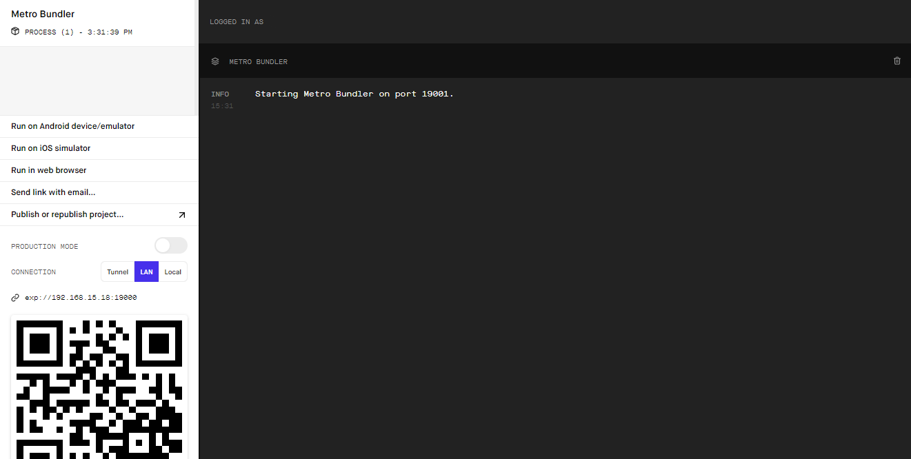

# MoneyTrees - Árvore Societária

Aplicativo desenvolvido como trablho para a  matéria Interação Humano Computador do curso de Análise e Desenvolvimento de Sistemas da FATEC-SP.
A aplicação tem como objetivo a visualização de empresas que são sócias de outras empresas.

## Getting Started

Para rodar localmente, você precisará intalar o [Git](https://git-scm.com) e o [Node.js](https://nodejs.org/en/download/) (que instala também o [npm](https://www.npmjs.com)) em sua máquina.

Execute os seguintes passos no terminal de commandos de sua preferência:

- Instale as dependências do projeto:
```
npm install
```

- Instale o CLI do Expo:
```
npm install -g expo-cli
```

Inicie a aplicação:
```
expo start
```

Após a inicialização do projeto, uma página como a abaixo deve aparecer no navegador:



Temos algumas opções de onde executar o aplicativo:
- ***Run on Android device/emulator***: executa o aplicativo em um emulador Android rodando na sua máquina. 
- ***Run on iOS device/emulator***: executa o aplicativo em um emulador iOS rodando na sua máquina.
- ***Run in web browser***: executa o aplicativo no prórpio navegador.
- Uma outra alternativa é instalar o aplicativo do Expo no seu celular, e, estando na mesma rede, basta escanear o QRCode com o aplicativo para que a aplicação rode diretamente no seu celular. 

## Built With

* [React Native](https://reactnative.dev) - Framework utilizadoManagement

## Dependencies
* [Back-end](https://github.com/guisena888/arvore-societaria-api) - API Rest

## Authors

* **Danillo Felipe Aragão** - [GitHub](https://github.com/danilloaragao)

See also the list of [contributors](https://github.com/your/project/contributors).

## License

Esse projeto é licenciado pela licença MIT - see the [LICENSE.md](LICENSE.md) file for details